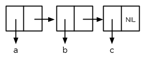

## `Box<T>` 在堆上存儲數據，並且可確定大小

> [ch15-01-box.md](https://github.com/rust-lang/book/blob/master/second-edition/src/ch15-01-box.md)
> <br>
> commit 348d78235faa10375ce5a3554e2c34d3275c174f

最簡單直接的智能指針是 *box*，它的類型是 `Box<T>`。 box 允許你將一個值放在堆上（第四章介紹過棧與堆）。示例 15-1 展示了如何使用 box 在堆上儲存一個`i32`：
(譯註:通常`i32`類型的值是直接放在棧上。)
<span class="filename">文件名: src/main.rs</span>

```rust
fn main() {
    let b = Box::new(5);
    println!("b = {}", b);
}
```

<span class="caption">示例 15-1：使用 box 在堆上儲存一個 `i32` 值</span>

這會打印出 `b = 5`。在這個例子中，我們可以像數據是儲存在棧上的那樣訪問 box 中的數據。正如任何擁有數據所有權的值那樣，當像 `b` 這樣的 box 在 `main` 的末尾離開作用域時，它將被釋放。這個釋放過程作用於 box 本身（位於棧上）和它所指向的數據（位於堆上）。

將一個單獨的值存放在堆上並不是很有意義，所以像示例 15-1 這樣單獨使用 box 並不常見。一個 box 的實用場景是當你希望確保類型有一個已知大小的時候。例如，考慮一下示例 15-2，它是一個用於 *cons list* 的枚舉定義，這是一個來源於函數式編程的數據結構類型。注意它還不能編譯：

<span class="filename">文件名: src/main.rs</span>

```rust
enum List {
    Cons(i32, List),
    Nil,
}
```

<span class="caption">示例 15-2：第一次嘗試定義一個代表 `i32` 值的 cons list 數據結構的枚舉</span>

我們實現了一個只存放 `i32` 值的 cons list。也可以選擇使用第十章介紹的泛型來實現一個類型無關的 cons list。

> #### cons list 的更多內容
>
> *cons list* 是一個來源於 Lisp 編程語言及其方言的數據結構。在 Lisp 中，`cons` 函數（「construct function" 的縮寫）利用兩個參數來構造一個新的列表，他們通常是一個單獨的值和另一個列表。
>
> cons 函數的概念涉及到更通用的函數式編程術語；「將 x 與 y 連接」 通常意味著構建一個新的容器而將 x 的元素放在新容器的開頭，其後則是容器 y 的元素。



> cons list 通過遞歸調用 `cons` 函數產生。代表遞歸的終止條件（base case）的規範名稱是 `Nil`，它宣佈列表的終止。注意這不同於第六章中的 「null」 或 「nil」 的概念，他們代表無效或缺失的值。
> (譯註: [參考**ANSI Common Lisp 中文版**](http://acl.readthedocs.io/en/latest/zhTW/ch3.html))<br> 

**cons list 是一個每個元素和之後的其餘部分都只包含一個值的列表**。列表的其餘部分由嵌套的 cons list 定義。其結尾由值 `Nil` 表示。cons list 在 Rust 中並不常見；通常 `Vec<T>` 是一個更好的選擇。但是實現這個數據結構是 `Box<T>` 實用性的一個好的例子。讓我們看看為什麼！

使用 cons list 來儲存列表 `1, 2, 3` 將看起來像這樣：

```rust
use List::{Cons, Nil};

fn main() {
    let list = Cons(1, Cons(2, Cons(3, Nil)));
}
```

第一個 `Cons` 儲存了 `1` 和另一個 `List` 值。這個 `List` 是另一個包含 `2` 的 `Cons` 值和下一個 `List` 值。這又是另一個存放了 `3` 的 `Cons` 值和最後一個值為 `Nil` 的 `List`，非遞歸成員代表了列表的結尾。

如果嘗試編譯上面的代碼，會得到如示例 15-3 所示的錯誤：

```text
error[E0072]: recursive type `List` has infinite size
 -->
  |
1 | enum List {
  | ^^^^^^^^^ recursive type has infinite size
2 |     Cons(i32, List),
  |     --------------- recursive without indirection
  |
  = help: insert indirection (e.g., a `Box`, `Rc`, or `&`) at some point to
  make `List` representable
```

<span class="caption">示例 15-3：嘗試定義一個遞歸枚舉時得到的錯誤</span>

這個錯誤表明這個類型 「有無限的大小」。為什麼呢？因為 `List` 的一個成員被定義為是遞歸的：它存放了另一個相同類型的值。這意味著 Rust 無法計算為了存放 `List` 值到底需要多少空間。讓我們一點一點來看：首先瞭解一下 Rust 如何決定需要多少空間來存放一個非遞歸類型。回憶一下第六章討論枚舉定義時的示例 6-2 中定義的 `Message` 枚舉：

```rust
enum Message {
    Quit,
    Move { x: i32, y: i32 },
    Write(String),
    ChangeColor(i32, i32, i32),
}
```

當 Rust 需要知道需要為 `Message` 值分配多少空間時，它可以檢查每一個成員並發現 `Message::Quit` 並不需要任何空間，`Message::Move` 需要足夠儲存兩個 `i32` 值的空間，依此類推。因此，`Message` 值所需的空間等於儲存其最大成員的空間大小。

與此相對當 Rust 編譯器檢查像示例 15-2 中的 `List` 這樣的遞歸類型時會發生什麼呢。編譯器嘗試計算出儲存一個 `List` 枚舉需要多少內存，並開始檢查 `Cons` 成員，那麼 `Cons` 需要的空間等於 `i32` 的大小加上 `List` 的大小。為了計算 `List` 需要多少內存，它檢查其成員，從 `Cons` 成員開始。`Cons`成員儲存了一個 `i32` 值和一個`List`值，這樣的計算將無限進行下去，如圖 15-4 所示：


<span class="caption">圖 15-4：一個包含無限個 `Cons` 成員的無限 `List`</span>

Rust 無法計算出要為定義為遞歸的類型分配多少空間，所以編譯器給出了示例 15-3 中的錯誤。這個錯誤也包括了有用的建議：

```text
= help: insert indirection (e.g., a `Box`, `Rc`, or `&`) at some point to
        make `List` representable
```

因為 `Box<T>` 是一個指針，我們總是知道它需要多少空間：指針需要一個 `usize` 大小的空間。這個 `usize` 的值將是堆數據的地址。而堆數據可以是任意大小，不過這個堆數據開頭的地址總是能放進一個 `usize` 中。我們可以將示例 15-2 的定義修改為像這裡示例 15-5 中的定義，並修改 `main` 函數對 `Cons` 成員中的值使用 `Box::new`：

<span class="filename">文件名: src/main.rs</span>

```rust
enum List {
    Cons(i32, Box<List>),
    Nil,
}

use List::{Cons, Nil};

fn main() {
    let list = Cons(1,
        Box::new(Cons(2,
            Box::new(Cons(3,
                Box::new(Nil))))));
}
```

<span class="caption">示例 15-5：為了已知大小使用 `Box<T>` 的 `List` 定義</span>

這樣編譯器就能夠計算出儲存一個 `List` 值需要的大小了。Rust 將會檢查 `List`，同樣的從 `Cons` 成員開始檢查。`Cons` 成員需要 `i32` 的大小加上一個 `usize` 的大小，因為 box 總是 `usize` 大小的，不管它指向的是什麼。接著 Rust 檢查 `Nil` 成員，它並不儲存一個值，所以 `Nil` 並不需要任何空間。我們通過 box 打破了這無限遞歸的連鎖。圖 15-6 展示了現在 `Cons` 成員看起來像什麼：


<span class="caption">圖 15-6：因為 `Cons` 存放一個 `Box` 所以 `List` 不是無限大小的了</span>

這就是 box 主要應用場景：打破無限循環的數據結構以便編譯器可以知道其大小。第十七章討論 trait 物件時我們將瞭解另一個 Rust 中會出現未知大小數據的情況。

雖然我們並不經常使用 box，他們也是一個瞭解智能指針模式的好的方式。`Box<T>` 作為智能指針經常被使用的兩個方面是他們 `Deref` 和 `Drop` trait 的實現。讓我們研究這些 trait 如何工作以及智能指針如何利用他們。